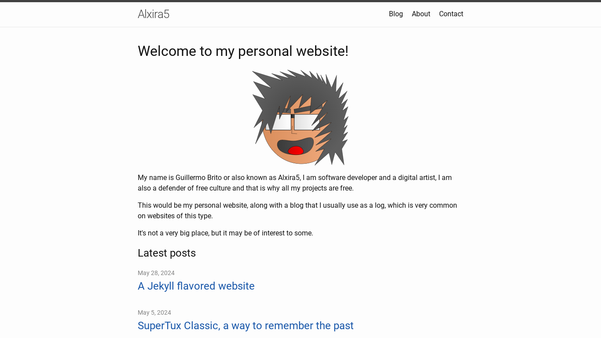

# My personal website

In this repository you will find the source code of my website, which
works with [Jekyll 4.3.3](https://jekyllrb.com/) and the
[Minima](https://github.com/jekyll/minima) theme.

You can see it in action at
[alxira5.vercel.app](https://alxira5.vercel.app).

## License

* [MIT License](LICENSE) for code.
* [CC-BY 4.0](https://creativecommons.org/licenses/by/4.0/deed.en) for
  content.
